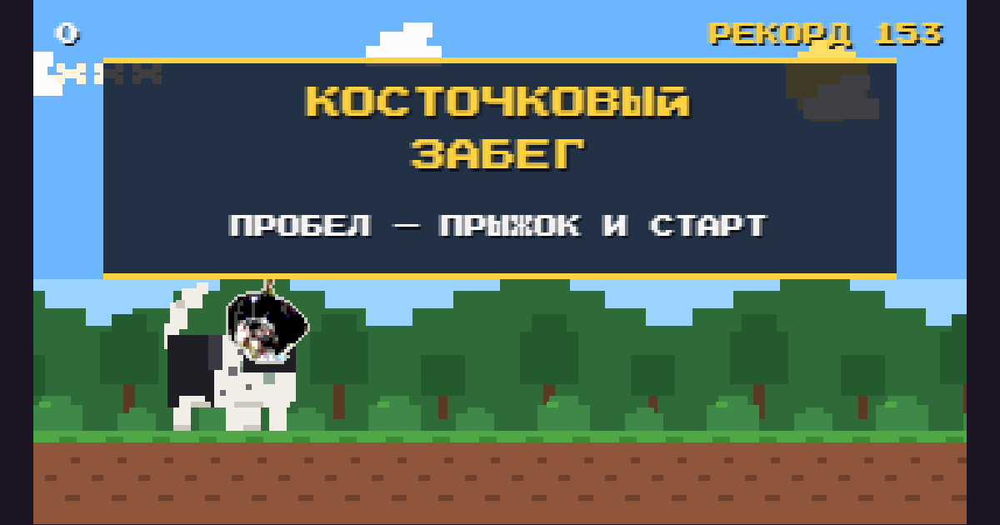

# Косточковый Забег

Восьмибитный раннер: ши-тцу бежит по парку, перепрыгивает заборы, камни и мусорные баки, обходит лужи и ловит падающие косточки.

## Играть

**https://pavelvo2.github.io/kostochkovyy-zabeg/**

Либо открыть `index.html` в браузере — файл самодостаточный, больше ничего не нужно.

## Управление

| Действие | Клавиатура | Телефон |
|---|---|---|
| Прыжок | `Пробел`, `↑`, `W` | тап по экрану |
| Прыжок выше | держать кнопку дольше | держать палец |
| Быстро вниз | `↓`, `S` | — |
| Пауза | `P` | — |
| Звук | `M` | кнопка под экраном |

## Правила

- Забор, камень и бак — удар, минус одна жизнь из трёх.
- Лужа не отнимает жизнь, но сбивает серию пойманной еды.
- Косточка даёт 10 очков, сосиска 25, миска 50. Каждые пять пойманных подряд поднимают множитель: ×2, ×3, ×4.
- Каждая пойманная еда делает собаку крупнее — до четырёх ступеней роста. Крупная прыгает выше и дольше парит в воздухе, зато и хитбокс у неё шире. Удар о препятствие сдувает её обратно до обычного размера.
- Упавшая на землю еда пропадает и обнуляет серию, так что ловить нужно в воздухе.
- Скорость растёт с пройденным расстоянием и упирается в потолок; интервалы между препятствиями пересчитываются под текущую скорость, чтобы прыжок всегда успевал.

## Как это устроено

Одна HTML-страница без сборки и зависимостей. Игра рисуется на `<canvas>` внутренним разрешением 320×180 и растягивается до размера экрана с `image-rendering: pixelated`. Звук — короткие square- и triangle-осцилляторы на WebAudio, музыка собирается из двух шестнадцатишаговых петель.

Морда собаки — настоящее фото, вшитое в страницу как data URI. При загрузке оно пережимается до спрайта 30×30, проходит нерезкое маскирование (уменьшение размывает черты, резкость возвращает их) и постеризуется до пяти уровней на канал. Фон вырезается по цвету: пиксели, у которых зелёный канал выше остальных, считаются травой и листвой, после чего остаётся только область, связная с центром кадра. По краю силуэта кладётся светлая окантовка, иначе тёмная голова тонет в зелени. Тело, лапы, хвост и шлейка нарисованы кодом из прямоугольников.

Собака рисуется в отдельный спрайт-канвас и выводится на экран целочисленным растягиванием — если масштабировать сам контекст, пиксель-арт расползается. Кнопка «Фото собаки» подставляет любое другое фото — оно проходит ту же обработку и сохраняется в `localStorage` конкретного браузера.

Рекорд тоже лежит в `localStorage`, то есть у каждого игрока свой.

## Файлы

- `index.html` — вся игра целиком.
- `preview.png` — картинка для превью ссылки в мессенджерах.
